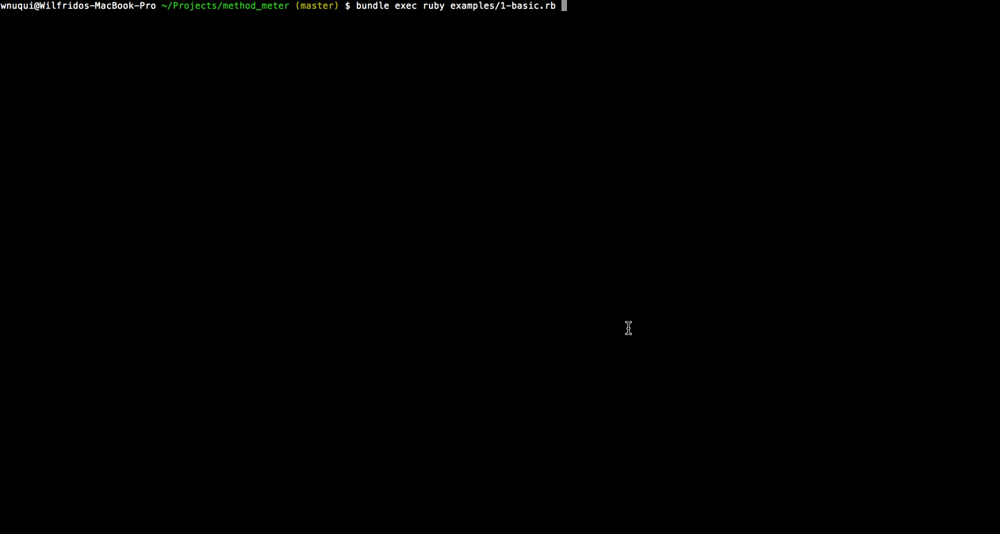

# MethodMeter [](https://wnuqui.semaphoreci.com/projects/method_meter)

`MethodMeter` is a library module that instruments **methods defined in a given object**. These methods are NOT from included or extended modules. These methods are also NOT from parent objects. By object, it means either a `class` or `module`.

## Installation

Add this line to your application's Gemfile:

```ruby
gem 'method_meter'
```

And then execute:

    $ bundle

Or install it yourself as:

    $ gem install method_meter

## Usage

```ruby
MethodMeter.observe Arithmeter

MethodMeter.measure!('key-1') do
  arithmeter = Arithmeter.new
  arithmeter.add 1, 3

  Arithmeter.sum 1, 3

  arithmeter = Arithmeter.new
  arithmeter.add 4, 3

  Arithmeter.sum 4, 3
end

ap MethodMeter.data
ap MethodMeter.measurement
```

More examples found here: https://github.com/wnuqui/method_meter/tree/master/examples

## In action



## Development

After checking out the repo, run `bin/setup` to install dependencies. Then, run `rake spec` to run the tests. You can also run `bin/console` for an interactive prompt that will allow you to experiment.

To install this gem onto your local machine, run `bundle exec rake install`. To release a new version, update the version number in `version.rb`, and then run `bundle exec rake release`, which will create a git tag for the version, push git commits and tags, and push the `.gem` file to [rubygems.org](https://rubygems.org).

## Contributing

Bug reports and pull requests are welcome on GitHub at https://github.com/wnuqui/method_meter. This project is intended to be a safe, welcoming space for collaboration, and contributors are expected to adhere to the [Contributor Covenant](http://contributor-covenant.org) code of conduct.

## License

The gem is available as open source under the terms of the [MIT License](https://opensource.org/licenses/MIT).

## Code of Conduct

Everyone interacting in the MethodMeter project’s codebases, issue trackers, chat rooms and mailing lists is expected to follow the [code of conduct](https://github.com/[USERNAME]/method_meter/blob/master/CODE_OF_CONDUCT.md).

## Acknowledgement

This library is based from https://github.com/change/method_profiler. This library is a bit more in terms of methods that it can observe. Also how it observe methods is completely different one than that of `method_profiler`. Please feel free to check the details in the code. :-)